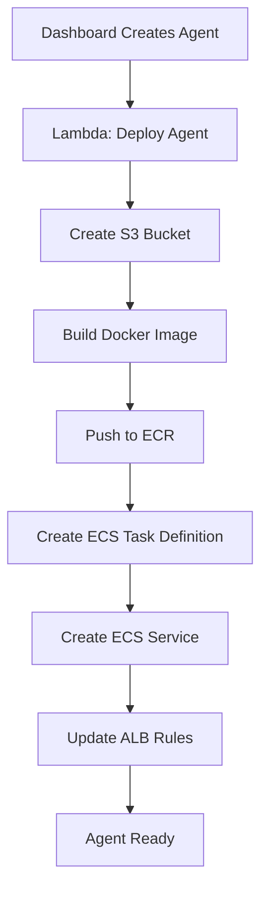

# 🚀 **TempoVoice Phase 2 - AWS Deployment System**

## 📋 **Complete AWS Architecture**

### **🏗️ Infrastructure Overview**
```
┌─────────────────┐    ┌─────────────────┐    ┌─────────────────┐
│   Dashboard     │    │   Agent Pool    │    │   External      │
│   (App Runner)  │    │   (ECS Fargate) │    │   Services      │
└─────────────────┘    └─────────────────┘    └─────────────────┘
         │                       │                       │
         │                       │                       │
    ┌────▼────┐            ┌────▼────┐            ┌────▼────┐
    │  ALB    │            │  ECR    │            │ Twilio  │
    │(Router) │            │(Images) │            │  Nova   │
    └─────────┘            └─────────┘            └─────────┘
         │                       │                       │
    ┌────▼────┐            ┌────▼────┐            ┌────▼────┐
    │  Lambda │            │   S3    │            │  Make   │
    │(Deploy) │            │(Storage)│            │   .com  │
    └─────────┘            └─────────┘            └─────────┘
```

---

## 🎯 **Deployment Workflow**

### **Step 1: Dashboard Agent Creation**
1. **User fills form** with agent configuration
2. **Dashboard validates** all required fields
3. **Database stores** agent configuration
4. **Lambda trigger** initiates deployment

### **Step 2: AWS Infrastructure Creation**


### **Step 3: Agent Runtime**
1. **Twilio calls** ALB endpoint
2. **ALB routes** to correct agent instance
3. **Agent processes** call with Nova Sonic
4. **Transcripts stored** in S3 bucket
5. **Webhooks triggered** for external systems

---

## 🛠️ **AWS Services Configuration**

### **1. Application Load Balancer (ALB)**
```yaml
# ALB Configuration
Name: tempo-voice-alb
Type: Application Load Balancer
Scheme: Internet-facing
Subnets: Public subnets (us-east-1a, us-east-1b)
Security Groups: 
  - Allow HTTP (80) from 0.0.0.0/0
  - Allow HTTPS (443) from 0.0.0.0/0
  - Allow custom ports for agent routing

# Target Groups
Target Group: tempo-agent-tg
Protocol: HTTP
Port: 3000
Health Check: /health
```

### **2. ECS Fargate Cluster**
```yaml
# ECS Cluster
Name: tempo-voice-cluster
Launch Type: FARGATE
Platform Version: LATEST

# Task Definition Template
Family: tempo-agent-template
Network Mode: awsvpc
CPU: 256 (.25 vCPU)
Memory: 512 MB
Execution Role: ecsTaskExecutionRole
Task Role: ecsTaskRole

# Container Definition
Name: tempo-agent
Image: {ECR_REPO_URI}/tempo-agent:latest
Port Mappings:
  - Container Port: 3000
    Protocol: tcp
Environment Variables:
  - AGENT_ID: {agentId}
  - AGENT_NAME: {agentName}
  - VOICE_ID: {voiceId}
  - AWS_REGION: {awsRegion}
  # ... all other config fields
```

### **3. ECR Repository**
```yaml
# ECR Repository
Name: tempo-voice-agents
Registry: {AWS_ACCOUNT_ID}.dkr.ecr.us-east-1.amazonaws.com
Image Tag: latest
Scan on Push: Enabled
```

### **4. S3 Buckets**
```yaml
# Per-Agent S3 Buckets
Bucket Name Pattern: tempo-agent-transcripts-{agentId}
Region: us-east-1
Storage Class: Standard
Versioning: Enabled
Lifecycle Rules:
  - Transition to IA after 30 days
  - Transition to Glacier after 90 days
  - Delete after 1 year

# Bucket Structure
/tempo-agent-transcripts-{agentId}/
├── calls/
│   ├── {callSid}/
│   │   ├── transcript.json
│   │   ├── recording.wav
│   │   └── metadata.json
│   └── ...
├── logs/
└── temp/
```

### **5. Lambda Deployment Function**
```typescript
// deploy-agent-lambda.ts
import { ECSClient, CreateServiceCommand } from '@aws-sdk/client-ecs';
import { S3Client, CreateBucketCommand } from '@aws-sdk/client-s3';
import { ECRClient, PutImageCommand } from '@aws-sdk/client-ecr';

export const handler = async (event: any) => {
  const { agentId, config } = event;
  
  try {
    // 1. Create S3 bucket for transcripts
    const s3BucketName = `tempo-agent-transcripts-${agentId}`;
    await createS3Bucket(s3BucketName, config.awsRegion);
    
    // 2. Build and push Docker image
    const imageUri = await buildAndPushImage(agentId, config);
    
    // 3. Create ECS task definition
    const taskDefinition = await createTaskDefinition(agentId, imageUri, config);
    
    // 4. Create ECS service
    const service = await createECSService(agentId, taskDefinition);
    
    // 5. Update ALB listener rule
    await updateALBRule(agentId, config);
    
    return {
      success: true,
      agentId,
      s3BucketName,
      serviceArn: service.serviceArn,
      taskDefinitionArn: taskDefinition.taskDefinitionArn
    };
    
  } catch (error) {
    console.error('Deployment failed:', error);
    throw error;
  }
};

async function createS3Bucket(bucketName: string, region: string) {
  const s3Client = new S3Client({ region });
  
  await s3Client.send(new CreateBucketCommand({
    Bucket: bucketName,
    CreateBucketConfiguration: {
      LocationConstraint: region === 'us-east-1' ? undefined : region
    }
  }));
  
  console.log(`S3 bucket created: ${bucketName}`);
}

async function createTaskDefinition(agentId: string, imageUri: string, config: any) {
  const ecsClient = new ECSClient({ region: config.awsRegion });
  
  const taskDefinition = {
    family: `tempo-agent-${agentId}`,
    networkMode: 'awsvpc',
    requiresCompatibilities: ['FARGATE'],
    cpu: '256',
    memory: '512',
    executionRoleArn: 'arn:aws:iam::ACCOUNT:role/ecsTaskExecutionRole',
    taskRoleArn: 'arn:aws:iam::ACCOUNT:role/ecsTaskRole',
    containerDefinitions: [
      {
        name: `agent-${agentId}`,
        image: imageUri,
        portMappings: [{ containerPort: 3000, protocol: 'tcp' }],
        environment: [
          { name: 'AGENT_ID', value: config.agentId },
          { name: 'AGENT_NAME', value: config.agentName },
          { name: 'AGENT_PROMPT', value: config.prompt },
          { name: 'AGENT_GUARDRAILS', value: JSON.stringify(config.guardrails) },
          { name: 'AGENT_KNOWLEDGE_BASE', value: JSON.stringify(config.knowledgeBase) },
          { name: 'VOICE_ID', value: config.voiceId },
          { name: 'MAKE_ENDPOINT', value: config.makeEndpoint || '' },
          { name: 'WEBHOOK_ENDPOINT', value: config.webhookEndpoint },
          { name: 'CALL_PHONE_NUMBER', value: config.callPhoneNumber },
          { name: 'TRANSFER_PHONE_NUMBER', value: config.transferPhoneNumber || '' },
          { name: 'SUMMARY_PHONE_NUMBER', value: config.summaryPhoneNumber || '' },
          { name: 'TWILIO_ACCOUNT_SID', value: config.twilioAccountSid },
          { name: 'TWILIO_API_SECRET', value: config.twilioApiSecret },
          { name: 'AWS_REGION', value: config.awsRegion },
          { name: 'S3_BUCKET_NAME', value: `tempo-agent-transcripts-${agentId}` },
          { name: 'SIP_ENDPOINT', value: config.sipEndpoint || '' },
          { name: 'NOVA_PICKUP_WEBHOOK_URL', value: config.novaPickupWebhookUrl || '' },
          { name: 'TRANSCRIPT_WEBHOOK_URL', value: config.transcriptWebhookUrl || '' },
          { name: 'ENABLE_RECORDING', value: config.enableRecording?.toString() },
          { name: 'ENABLE_TRANSCRIPTION', value: config.enableTranscription?.toString() },
          { name: 'MAX_CONVERSATION_LENGTH', value: config.maxConversationLength?.toString() },
          { name: 'MAX_SESSION_DURATION', value: config.maxSessionDuration?.toString() },
          { name: 'MAX_INAPPROPRIATE_ATTEMPTS', value: config.maxInappropriateAttempts?.toString() }
        ],
        logConfiguration: {
          logDriver: 'awslogs',
          options: {
            'awslogs-group': '/ecs/tempo-agents',
            'awslogs-region': config.awsRegion,
            'awslogs-stream-prefix': 'ecs'
          }
        }
      }
    ]
  };

  const result = await ecsClient.send(new RegisterTaskDefinitionCommand(taskDefinition));
  return result.taskDefinition;
}
```

### **6. ALB Listener Rules**
```yaml
# ALB Listener Rules for Agent Routing
Listener: HTTP (Port 80)
Rules:
  - Priority: 100
    Conditions:
      - Field: path-pattern
        Values: ["/agent/*/incoming-call"]
    Actions:
      - Type: forward
        TargetGroupArn: {tempo-agent-tg-arn}
        
  - Priority: 200
    Conditions:
      - Field: path-pattern
        Values: ["/agent/*/media-stream"]
    Actions:
      - Type: forward
        TargetGroupArn: {tempo-agent-tg-arn}
        
  - Priority: 300 (Default)
    Actions:
      - Type: forward
        TargetGroupArn: {tempo-agent-tg-arn}
```

---

## 🔧 **Agent Template Repository Structure**

### **Repository: `tempo-voice-agent-template`**
```
tempo-voice-agent-template/
├── src/
│   ├── server.ts              # Main Fastify server (configurable)
│   ├── config-loader.ts       # Environment-based configuration
│   ├── nova-client.ts         # Nova Sonic integration
│   ├── knowledge-base-service.ts # Dynamic KB loader
│   ├── voice-config.ts        # Voice selection service
│   ├── guard-rails.ts         # Configurable guardrails
│   ├── call-recording-service.ts
│   ├── simple-call-transfer.ts
│   ├── voicemail-service.ts
│   ├── transcript-storage-service.ts
│   ├── transcript-api-endpoints.ts
│   ├── types.ts
│   └── consts.ts
├── Dockerfile                 # Container configuration
├── package.json              # Dependencies
├── tsconfig.json             # TypeScript config
└── README.md
```

### **Configurable Server.ts**
```typescript
// src/server.ts (modified for multi-tenancy)
import { ConfigLoader } from './config-loader';

// Load configuration at startup
const config = ConfigLoader.loadConfig();

// Initialize services with config
const knowledgeBaseService = new KnowledgeBaseService(config.knowledgeBase);
const voiceConfigService = new VoiceConfigService(config.voiceId);
const guardRailsService = new GuardRailsService({
  maxConversationLength: config.maxConversationLength,
  maxSessionDuration: config.maxSessionDuration,
  maxInappropriateAttempts: config.maxInappropriateAttempts,
  customRules: config.guardrails
});

// Create system prompt from config
const createSystemPrompt = () => {
  return `${config.prompt}

🎯 TOOL CALLING INSTRUCTIONS (CRITICAL):
You are ${config.agentName} - ${config.description}

Available tools:
1. end_call - End the conversation gracefully
2. transfer_call - Transfer to human agent
3. voicemail - Let customer leave message
4. schedule_callback - Schedule callback

⚠️ CRITICAL: When customer says goodbye:
1. Say: "Thank you for calling ${config.agentName}. Have a great day!"
2. Call end_call tool immediately
3. Do NOT continue conversation after end_call`;
};

// Rest of server setup with config...
```

---

## 🚀 **Deployment Commands**

### **1. Dashboard Deployment (App Runner)**
```bash
# Deploy dashboard to AWS App Runner
aws apprunner create-service \
  --service-name tempo-voice-dashboard \
  --source-configuration '{
    "ImageRepository": {
      "ImageIdentifier": "public.ecr.aws/docker/library/node:18",
      "ImageConfiguration": {
        "Port": "3000",
        "RuntimeEnvironmentVariables": {
          "NODE_ENV": "production",
          "DATABASE_URL": "postgresql://...",
          "JWT_SECRET": "...",
          "ALB_ENDPOINT": "https://your-alb-endpoint.com"
        }
      }
    }
  }'
```

### **2. Infrastructure Setup (Terraform)**
```hcl
# main.tf
provider "aws" {
  region = "us-east-1"
}

# VPC and Networking
resource "aws_vpc" "tempo_voice" {
  cidr_block = "10.0.0.0/16"
}

# ECS Cluster
resource "aws_ecs_cluster" "tempo_voice" {
  name = "tempo-voice-cluster"
}

# Application Load Balancer
resource "aws_lb" "tempo_voice" {
  name               = "tempo-voice-alb"
  internal           = false
  load_balancer_type = "application"
  subnets            = aws_subnet.public[*].id
}

# ECR Repository
resource "aws_ecr_repository" "tempo_agents" {
  name = "tempo-voice-agents"
}

# Lambda Function for Deployment
resource "aws_lambda_function" "deploy_agent" {
  filename         = "deploy-agent.zip"
  function_name    = "deploy-tempo-agent"
  role            = aws_iam_role.lambda_role.arn
  handler         = "index.handler"
  runtime         = "nodejs18.x"
  timeout         = 300
}
```

### **3. Agent Deployment Pipeline**
```bash
# 1. Build agent image
docker build -t tempo-agent:latest .

# 2. Tag for ECR
docker tag tempo-agent:latest {AWS_ACCOUNT_ID}.dkr.ecr.us-east-1.amazonaws.com/tempo-voice-agents:latest

# 3. Push to ECR
aws ecr get-login-password --region us-east-1 | docker login --username AWS --password-stdin {AWS_ACCOUNT_ID}.dkr.ecr.us-east-1.amazonaws.com
docker push {AWS_ACCOUNT_ID}.dkr.ecr.us-east-1.amazonaws.com/tempo-voice-agents:latest

# 4. Trigger Lambda deployment
aws lambda invoke \
  --function-name deploy-tempo-agent \
  --payload '{"agentId":"agent-123","config":{...}}' \
  response.json
```

---

## 📊 **Monitoring & Observability**

### **CloudWatch Metrics**
- **ECS Service**: CPU, Memory, Task Count
- **ALB**: Request Count, Response Time, Error Rate
- **Lambda**: Invocations, Duration, Errors
- **S3**: Request Count, Storage Size

### **CloudWatch Logs**
- **ECS Log Group**: `/ecs/tempo-agents`
- **Lambda Log Group**: `/aws/lambda/deploy-tempo-agent`
- **ALB Logs**: Access logs to S3

### **Cost Optimization**
- **ECS Fargate Spot**: 70% cost reduction for non-critical agents
- **S3 Lifecycle**: Automatic archival and deletion
- **ALB**: Pay per hour, scale to zero when no agents
- **Lambda**: Pay per invocation

---

## 🔒 **Security & Compliance**

### **IAM Roles & Policies**
```json
{
  "Version": "2012-10-17",
  "Statement": [
    {
      "Effect": "Allow",
      "Action": [
        "bedrock:InvokeModel",
        "bedrock:InvokeModelWithResponseStream"
      ],
      "Resource": "*"
    },
    {
      "Effect": "Allow",
      "Action": [
        "s3:GetObject",
        "s3:PutObject",
        "s3:DeleteObject"
      ],
      "Resource": "arn:aws:s3:::tempo-agent-transcripts-*"
    }
  ]
}
```

### **Network Security**
- **VPC**: Private subnets for ECS tasks
- **Security Groups**: Restrictive inbound/outbound rules
- **ALB**: SSL/TLS termination
- **WAF**: Web Application Firewall for ALB

---

## 🎯 **URLs & Endpoints**

### **Agent Invocation URLs**
```
# Pattern: https://{ALB_ENDPOINT}/agent/{agentId}/incoming-call
https://tempo-voice-alb-1234567890.us-east-1.elb.amazonaws.com/agent/agent-123/incoming-call

# Twilio Configuration
Voice URL: https://tempo-voice-alb-1234567890.us-east-1.elb.amazonaws.com/agent/agent-123/incoming-call
HTTP Method: POST
```

### **S3 Bucket URLs**
```
# Transcript Access
https://tempo-agent-transcripts-agent-123.s3.amazonaws.com/calls/{callSid}/transcript.json

# Recording Access
https://tempo-agent-transcripts-agent-123.s3.amazonaws.com/calls/{callSid}/recording.wav
```

### **Dashboard URLs**
```
# Main Dashboard
https://tempo-voice-dashboard-1234567890.us-east-1.awsapprunner.com/dashboard

# Agent Management
https://tempo-voice-dashboard-1234567890.us-east-1.awsapprunner.com/dashboard/agents

# Phone Numbers
https://tempo-voice-dashboard-1234567890.us-east-1.awsapprunner.com/dashboard/numbers
```

---

This comprehensive AWS deployment system provides a **scalable, multi-tenant voice AI agent platform** with full automation, monitoring, and cost optimization! 🚀
